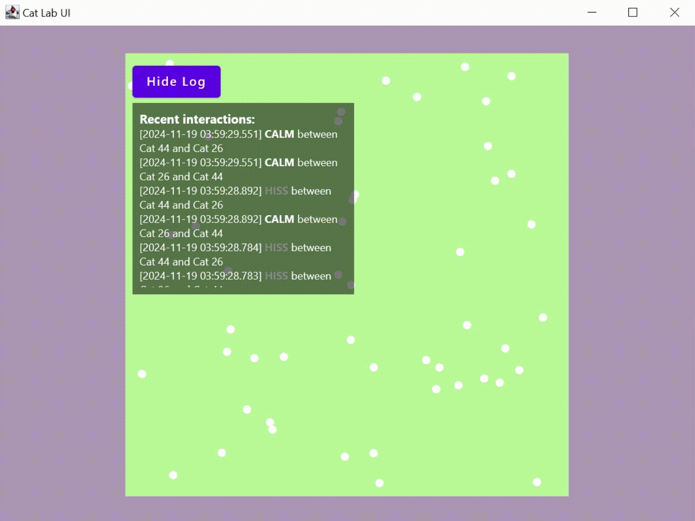

# Cat Lab

[](https://github.com/Parzival-05/comp-graph.lab1/actions/workflows/ktlint.yml)
[](https://github.com/Parzival-05/comp-graph.lab1/actions/workflows/build_and_test.yml)

Этот проект моделирует и визуализирует поведение котов на прямоугольной карте, принимая во внимание их взаимодействие
на расстоянии.

- За время TAU кот перемещается в случайную точку в окрестности предыдущей позиции.
- Если два кота находятся на расстоянии, не превышающем _r₀_, они пытаются начать **драку** с вероятностью _1_.
- Если два кота находятся на расстоянии _R₀ > r₀_, они начинают **шипеть** с вероятностью, обратно пропорциональной
  квадрату расстояния между ними.
- В противном случае кот остается **спокойным**.

## Использование

Чтобы запустить приложение, клонируйте этот репозиторий и выполните приведенную ниже команду:

```
./gradlew run
```

## Фичи

1. [x] Логирование взаимодействий каждого кота.
2. [x] [Метрики](src/main/kotlin/radar/metrics/metrics.kt): Euclidean, Manhattan, Great Circle
3. [x] Коты могут покидать карту и появляться на границе.
4. [x] Коты имеют сложное поведение: могут останавливаться на некоторое время и спать, имеют полосу здоровья, потеряв
   которое могут умереть и впоследствии стать призраками.
5. [x] Плавная и красивая отрисовка.
6. [x] Коты имеют сложную систему перемещений.

## Демонстрация

| Визуализация                                                                                            |
|---------------------------------------------------------------------------------------------------------|
| **PARTICLE_COUNT = 50, TAU = 100, MAX_PARTICLE_SPEED=**                                                 |
|        |
| **PARTICLE_COUNT = 50000, TAU = 500, MAX_PARTICLE_SPEED=**                                              |
|  |

## Task distribution

| **Имя**        | **Задачи**                     |
|----------------|--------------------------------|
| Ахмедов Давид  | Алгоритм + Архитектура + CI    |
| Ермлович Анна  | UI + README.md                 |
| Парфенов Данил | Логирование + тесты + паттерны |

## Лицензия

Этот проект лицензирован по лицензии MIT - подробности смотрите в файле [LICENSE](LICENSE).
